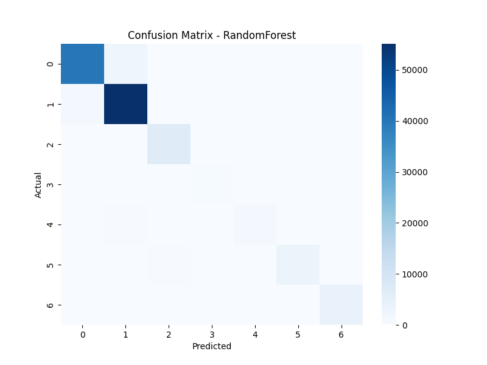

# 🌲 Forest Cover Type Classification

This project predicts **forest cover type** (7 categories) using cartographic variables such as elevation, slope, aspect, and soil type.
We compare two popular machine learning algorithms:

* **Random Forest Classifier**
* **XGBoost Classifier**

The dataset used is the **Covertype dataset** from the [UCI Machine Learning Repository](https://archive.ics.uci.edu/ml/datasets/covertype), available directly through `scikit-learn`.

---

## 📌 Objectives

* Load and preprocess the **Forest Cover Type dataset**
* Train and evaluate **Random Forest** and **XGBoost**
* Compare model performance
* Perform **hyperparameter tuning** for Random Forest
* Visualize **confusion matrices** and **feature importance**

---

## ⚙️ Installation & Setup

1. **Clone the repository**

   ```bash
   git clone https://github.com/yourusername/forest-cover-type-classification.git
   cd forest-cover-type-classification
   ```

2. **Create and activate a virtual environment (recommended)**

   ```bash
   python -m venv venv
   # Windows
   venv\Scripts\activate
   # Linux/Mac
   source venv/bin/activate
   ```

3. **Install dependencies**

   ```bash
   pip install -r requirements.txt
   ```

   **requirements.txt**

   ```
   pandas
   numpy
   matplotlib
   seaborn
   scikit-learn
   xgboost
   ```

---

## ▶️ Running the Project

Run the script:

```bash
python forest_cover.py
```

This will:

* Load the dataset
* Train Random Forest and XGBoost models
* Print classification reports & accuracy
* Save confusion matrix plots in the `images/` folder
* Save feature importance plots
* Perform hyperparameter tuning for Random Forest

---

## 📊 Results

Example results (may vary slightly depending on random seed):

* **Random Forest Accuracy:** \~95%
* **XGBoost Accuracy:** \~94–95%

### 🔹 Confusion Matrices

Random Forest Confusion Matrix


XGBoost Confusion Matrix


---

### 🔹 Feature Importance

Random Forest Feature Importance


XGBoost Feature Importance


---

## 🚀 Future Work

* Add hyperparameter tuning for **XGBoost**
* Use **cross-validation** for stronger evaluation
* Test additional models (**LightGBM, CatBoost, Neural Networks**)
* Deploy via **Flask/Streamlit** as a web app

---

## 📚 References

* [UCI Covertype Dataset](https://archive.ics.uci.edu/ml/datasets/covertype)
* [Scikit-learn Documentation](https://scikit-learn.org/stable/)
* [XGBoost Documentation](https://xgboost.readthedocs.io/)
